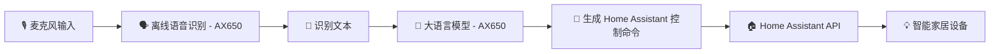

# 🏠 HomeAssistant Edge

[](LICENSE)
[]()
[]()

**HomeAssistant Edge** 是一个基于 **AX650 本地 AI 芯片** 的 Home Assistant 离线语音控制系统。  
集成 **离线语音识别 (ASR)** 与 **本地大语言模型 (LLM)**，无需云服务，响应超低延迟并保护隐私。

---

## ✨ 功能特点
- 🔌 **完全离线**：ASR 和 LLM 全部运行于 AX650
- 🗣 **语音控制** Home Assistant 中的各类智能家居设备
- ⚡ **毫秒级响应**：本地推理，无需等待云端
- 🌐 **可扩展性强**：通过 `devices.yaml` 快速适配新设备
- 🔒 **隐私安全**：不上传音频和数据到云端

> ⚠ 当前仅支持 **英语语音指令**  
> ⚠ 详细支持设备类型见下文

---

## 📋 当前支持设备与服务

| 设备类型 | 可用操作（service） |
|----------|--------------------|
| **灯光 (`light`)** | `turn_on`（可调颜色/亮度）、`turn_off`、`toggle` |
| **窗帘/百叶窗 (`blinds` / `cover`)** | `open_cover`、`close_cover`、`stop_cover`、`toggle` |
| **风扇 (`fan`)** | `turn_on`、`turn_off`、`toggle`、`increase_speed`、`decrease_speed` |
| **车库门 (`garage_door`)** | `open_cover`、`close_cover`、`stop_cover`、`toggle` |
| **恒温/空调 (`climate`)** | `set_temperature`、`set_humidity`、`set_fan_mode`、`set_hvac_mode` |
| **门锁 (`lock`)** | `lock`、`unlock` |
| **媒体播放器 (`media_player`)** | `turn_on`、`turn_off`、`toggle`、`volume_up`、`volume_down`、`volume_mute`、`media_play`、`media_pause`、`media_stop`、`media_play_pause`、`media_next_track`、`media_previous_track` |
| **开关 (`switch`)** | `turn_on`、`turn_off`、`toggle` |

---

## 🚀 系统架构


---

## 📦 安装部署

📖 **快速启动（推荐）**  
如果你想快速完成 HA + ASR + GPT 服务的本地部署，请参考本项目的  
[📄 Quick Config 指南](./doc/quick_config.md)  

该指南包含：
- 如何启动离线 ASR 服务
- 如何安装并运行 HA-GPT 模型
- 如何获取并填写必要的配置（IP、令牌等）

完成快速配置后，你可以继续执行以下步骤完善安装。

---

### 1️⃣ 克隆仓库
```bash
git clone https://github.com/yuyun2000/HomeAssistant-Edge.git
cd HomeAssistant-Edge
```

### 2️⃣ 安装依赖
建议使用 **Python 3.9+**：
```bash
pip install -r requirements.txt
```

### 3️⃣ 配置 `.env`
在项目根目录创建 `.env` 文件：
```ini
# Home Assistant
HA_BASE_URL=http://192.168.1.100:8123
HA_TOKEN=your_long_lived_access_token

# 本地 ASR API
ASR_API_URL=http://192.168.1.101:8001/recognize

# 本地 LLM API
LLM_API_KEY=sk-xxxx
LLM_BASE_URL=http://192.168.1.101:8000/v1
LLM_MODEL=qwen2.5-1.5B-p1024-ha-ax650
```

📌 注意：
- `HA_TOKEN` 在 Home Assistant **用户设置 → 安全** 中生成长期访问令牌。
- **ASR** / **LLM** / **Home Assistant** 需在局域网内可访问。
- **ASR 与 LLM 必须运行在 AX650 设备上**。

---

### 4️⃣ 配置设备 (`devices.yaml`)
`devices.yaml` 决定了 LLM 可以控制哪些设备。

**示例**（默认）：
```yaml
services:
  - name: light.turn_on
    params: ["rgb_color", "brightness"]
  - name: light.turn_off
  - name: cover.open
  - name: cover.close

devices:
  - id: light.livingroom
    name: "Livingroom Light"
    state: "on"
    brightness: 80
  - id: light.bedroom
    name: "Bedroom Light"
    state: "off"
  - id: cover.cover
    name: "Living Room Curtain"
    state: "closed"
```
devices的id需要是ha中的分配的id，name则是该设备口语化的名字
---

## 🛠 添加自定义设备

如果你希望 LLM 能控制更多设备（例如空调、风扇），需要在 `devices.yaml` 增加对应的 **Service** 和 **Device**。

### ① 获取 Home Assistant 设备信息
- 打开 **开发者工具 → 状态** 查看设备的 **实体 ID**
- 在 **开发者工具 → 服务** 查看可用的 Service 及参数

---

### ② 编辑 `devices.yaml`
**示例：添加空调（climate）**
```yaml
services:
  # 原有的灯光和窗帘
  - name: light.turn_on
    params: ["rgb_color", "brightness"]
  - name: light.turn_off
  - name: cover.open
  - name: cover.close

  # 新增空调服务
  - name: climate.set_temperature
    params: ["temperature"]
  - name: climate.set_hvac_mode
    params: ["hvac_mode"]

devices:
  # 原有设备
  - id: light.livingroom
    name: "Livingroom Light"
    state: "on"
    brightness: 80

  # 新增空调
  - id: climate.livingroom_ac
    name: "Living Room AC"
    state: "cool"
    temperature: 24
    hvac_mode: "cool"
```

---

### ③ 保存 & 重启
保存文件后，重启项目：
```bash
python main.py
```
LLM 会自动加载新的 `devices.yaml`，并以此生成 System Prompt，从而识别/执行新设备的指令。

💡 **小贴士**：
- `id` 必须是 Home Assistant 实体 ID
- `params` 对应 Home Assistant 服务的参数名
- `state`/`brightness`/`temperature` 等是可选属性，但有助于 LLM 理解设备状态
- 添加不在模型训练范围内的 service 可能无法正确生成调用指令

---

## ▶️ 运行
```bash
python main.py
```

运行时会提示：
```
Home Assistant Controller - Press SPACE to start/stop recording
```
- **空格键** 开始/结束录音
- 系统会调用 ASR → 生成文本 → LLM 解析 → 调用 API
- **ESC** 退出

---

## 💡 示例
**语音输入：**
```
Turn on the living room light to blue
```
**执行结果：**
```
Assistant: Sure, turning on the living room light to blue.
Executing: {"service": "light.turn_on", "target_device": "light.livingroom", "rgb_color": [0,0,255]}
```

---

## 📁 项目结构
```
HomeAssistant-Edge/
├── main.py              # 入口：录音、ASR调用、LLM调用
├── ha_control.py        # 控制 Home Assistant API
├── chat.py              # LLM 封装
├── config.py            # 读取 .env & devices.yaml
├── devices.yaml         # 用户配置设备和服务
├── requirements.txt     # Python 依赖
└── README.md
```

---

## ⚠️ 注意事项
- 当前仅支持 **英语语音指令**
- 已测试的设备类型见「当前支持设备与服务」
- 请确保 Home Assistant API 已开启
- `pyaudio` 录音功能需确保麦克风可用

---

## 📜 License
MIT License - 详见 [LICENSE](LICENSE)

---

## 🤝 贡献
欢迎通过 **Issue** / **Pull Request** 改进本项目

---

## 👤 作者
- [yuyun2000](https://github.com/yuyun2000)  
- [🌐 GitHub 项目地址](https://github.com/yuyun2000/HomeAssistant-Edge)
