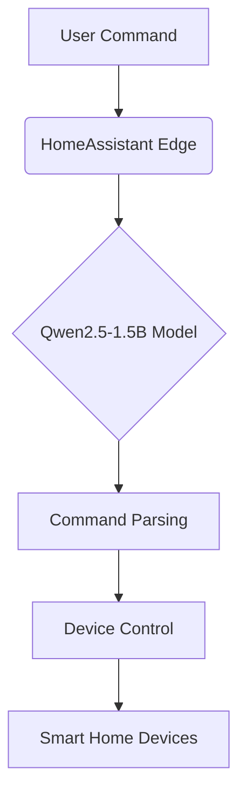

# HomeAssistant Edge - AI-Powered Home Automation

HomeAssistant Edge is an intelligent home automation system that integrates with HomeAssistant to control smart devices using natural language. It features a fine-tuned 1.5B Qwen2.5 model running on an AX650 edge computing chip for fast, offline processing.

## Key Features
- Natural language control of lights, curtains, and other smart devices
- Offline processing on AX650 edge computing chip
- Fast response times with local inference
- Privacy-focused design (no cloud dependency)

## Technical Specifications
- **AI Model**: Qwen2.5-1.5B fine-tuned for home automation
- **Hardware**: AX650 edge computing chip
- **Inference Speed**: <100ms response time
- **Connectivity**: Local network only

## Setup Instructions

1. Install dependencies:
```bash
pip install -r requirements.txt
```

2. Configure your smart home devices in `ha_control.py`

3. Start the interactive assistant:
```bash
python interactive_ha.py
```

## Usage Examples

```bash
You: Turn on the living room lights
Assistant: I'll turn on the lights for you.
Executing: {'service': 'light.turn_on', 'target_device': 'light.livingroom'}

You: Open the bedroom curtains
Assistant: I'll open the curtains for you.
Executing: {'service': 'cover.open', 'target_device': 'cover.bedroom'}
```

## System Architecture


## Contributing
Contributions are welcome! Please open an issue or pull request on our GitHub repository.

## License
MIT License
