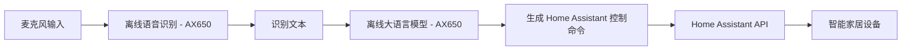

# HomeAssistant Edge

[](LICENSE)
[]()
[]()

**HomeAssistant Edge** 是一个运行在 **AX650 本地 AI 芯片**上的 Home Assistant 离线语音控制系统。  
本项目集成了 **离线语音识别 (ASR)** 与 **本地大语言模型 (LLM)**，无需依赖云服务，完全本地推理，保护隐私，低延迟响应。

当前功能特点：
- 🔌 **完全离线** - ASR 和 LLM 全部运行在 AX650 上
- 🗣 **语音控制** Home Assistant 中的设备（目前仅测试灯光与窗帘）
- ⚡ **低延迟** - 本地推理，指令响应快
- 🌐 **可扩展** - 支持自定义设备，通过修改 `devices.yaml` 适配你的家庭
- 🔒 **隐私安全** - 不上传任何音频或数据到云端

> 目前仅支持 **英语语音指令**，由于测试设备有限，除灯光与窗帘外其他设备的稳定性尚未验证。

---

## 🚀 系统架构



- **ASR**：本地语音识别服务（AX650 芯片推理）
- **LLM**：本地大语言模型（Qwen / ChatGLM 等可部署在 AX650 上）
- **HA**：Home Assistant API 调用
- **控制范围**：目前仅测试灯光 (`light`) 与窗帘 (`cover`)

---

## 📦 安装部署

### 1. 克隆仓库
```bash
git clone https://github.com/yuyun2000/HomeAssistant-Edge.git
cd HomeAssistant-Edge
```

### 2. 安装依赖
建议使用 Python 3.9+。
```bash
pip install -r requirements.txt
```

### 3. 配置 `.env`
在项目根目录创建 `.env` 文件，例如：
```ini
# Home Assistant 配置
HA_BASE_URL=http://192.168.1.100:8123
HA_TOKEN=your_home_assistant_long_lived_access_token

# 本地 ASR API
ASR_API_URL=http://192.168.1.101:8001/recognize

# 本地 LLM API
LLM_API_KEY=sk-xxxx
LLM_BASE_URL=http://192.168.1.101:8000/v1
LLM_MODEL=qwen2.5-1.5B-p1024-ha-ax650
```
> 📌 **注意**  
> - `HA_TOKEN` 需在 Home Assistant 用户配置界面生成长期访问令牌。  
> - 所有服务（ASR/LLM/HA）需在局域网内可访问。  
> - **ASR & LLM 需部署在 AX650 上**。

### 4. 配置设备列表
编辑 `devices.yaml`：
```yaml
services:
  - name: light.turn_on
    params: ["rgb_color", "brightness"]
  - name: light.turn_off
  - name: cover.open
  - name: cover.close

devices:
  - id: light.livingroom
    name: "Livingroom Light"
    state: "on"
    brightness: 80
  - id: cover.curtain
    name: "Living Room Curtain"
    state: "closed"
```
此文件定义了 Home Assistant 的可控设备和支持的服务。  
**修改此文件即可适配不同家庭配置，无需改代码。**

---

## ▶️ 运行

在终端中运行：
```bash
python main.py
```

运行后提示：
```
Home Assistant Controller - Press SPACE to start/stop recording
```
- 按 **空格键** 开始录音（再次按空格结束录音）。
- 程序会将指令发送至本地 ASR 解析为文本，再交给 LLM 生成 Home Assistant 控制命令。
- 自动调用 Home Assistant API 执行操作。
- 按 **ESC** 退出程序。

---

## 💡 示例

**语音输入：**
```
Turn on the living room light to blue
```

**系统执行：**
```
Assistant: Sure, turning on the living room light to blue.
Executing: {"service": "light.turn_on", "target_device": "light.livingroom", "rgb_color": [0,0,255]}
```

---

## 📁 文件结构
```
HomeAssistant-Edge/
├── main.py              # 前端交互：录音、ASR调用、LLM调用
├── ha_control.py        # 控制 Home Assistant API
├── chat.py              # LLM 封装，动态加载 devices.yaml 配置
├── config.py            # 读取 .env + 设备配置
├── devices.yaml         # 用户可编辑的设备与服务列表
├── requirements.txt     # 项目依赖
└── README.md
```

---

## ⚠️ 注意事项
- 目前仅支持 **英语语音指令**
- 仅测试过灯光 (`light`) 和窗帘 (`cover`) ，其他设备未经完整验证。
- 本项目依赖 Home Assistant 的 REST API，需要开启 API 访问。
- 录音功能依赖 `pyaudio`，请确保麦克风可用。

---

## 📜 License
MIT License - 详见 [LICENSE](LICENSE) 文件。

---

## 🤝 贡献
欢迎提交 **Issue** 或 **Pull Request** 来改进本项目。

---

## 📌 作者
- [yuyun2000](https://github.com/yuyun2000)  
- 项目仓库：[HomeAssistant Edge](https://github.com/yuyun2000/HomeAssistant-Edge)
