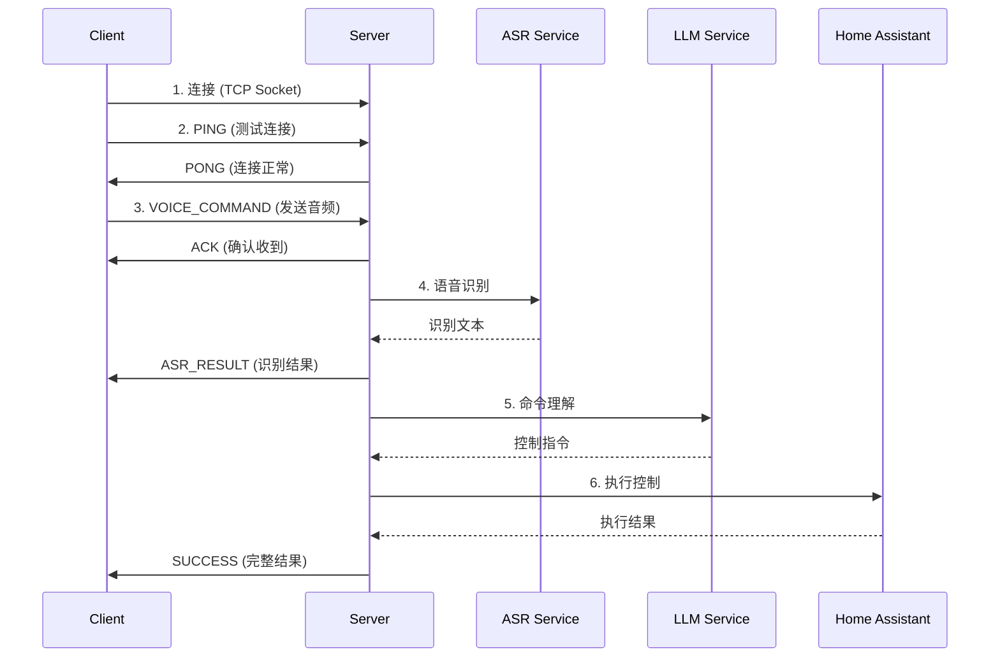

# 🌐 HomeAssistant-Edge 服务接入文档

## 📖 概述

HomeAssistant-Edge 提供了一个基于 TCP Socket 的语音控制服务，支持多客户端并发连接。本文档详细说明了如何使用不同编程语言接入该服务。

### 核心特性
- ✅ **TCP Socket 通信**：基于标准 TCP 协议，跨平台兼容
- ✅ **JSON 消息格式**：易于解析和调试
- ✅ **异步响应**：支持请求追踪和异步处理
- ✅ **多客户端支持**：每个客户端独立的对话上下文
- ✅ **语音识别 + LLM + 设备控制**：完整的语音控制流程

---

## 🏗️ 架构说明

```
┌─────────────┐         ┌──────────────┐         ┌─────────────┐
│   Client    │ ◄─────► │    Server    │ ◄─────► │ Home        │
│  (任何语言)  │  TCP    │  (Python)    │   API   │ Assistant   │
│             │ Socket  │              │         │             │
└─────────────┘         └──────────────┘         └─────────────┘
      │                        │
      │                        ├─► ASR (语音识别)
      │                        ├─► LLM (命令理解)
      │                        └─► 设备控制
```

### 服务端配置
- **默认地址**: `0.0.0.0:9999`
- **协议**: TCP Socket
- **编码**: UTF-8
- **消息格式**: JSON

---

## 📡 通信协议

### 消息结构

所有消息采用 **长度前缀 + JSON 内容** 的格式：

```
[4字节长度][JSON消息体]
```

- **长度字段**: 4字节大端序整数，表示 JSON 消息体的字节长度
- **JSON消息体**: UTF-8 编码的 JSON 字符串

### 消息类型

#### 1. 客户端 → 服务端

| 消息类型 | 说明 | 是否需要音频数据 |
|---------|------|----------------|
| `PING` | 心跳检测 | ❌ |
| `VOICE_COMMAND` | 发送语音命令 | ✅ |
| `HEARTBEAT` | 保持连接 | ❌ |

#### 2. 服务端 → 客户端

| 消息类型 | 说明 | 数据内容 |
|---------|------|---------|
| `PONG` | 心跳响应 | 字符串消息 |
| `ACK` | 确认收到音频 | 字符串消息 |
| `ASR_RESULT` | 语音识别结果 | `{text, asr_time}` |
| `SUCCESS` | 命令执行成功 | `{text, response, command, execution_status, asr_time, llm_time, total_time}` |
| `INFO` | 信息提示 | `{text, response, message, asr_time, llm_time}` |
| `ERROR` | 错误信息 | 错误描述字符串 |

---

## 🔄 完整交互流程



---

## 📋 音频格式要求

### WAV 文件规格
- **采样率**: 16000 Hz
- **声道数**: 1 (单声道)
- **位深度**: 16-bit PCM
- **字节序**: Little-endian

### 音频数据格式
发送 `VOICE_COMMAND` 时，音频数据应为：
- **原始 PCM 数据**（不包含 WAV 文件头）
- **16-bit signed integer** 格式
- **Little-endian** 字节序

### 正确读取 WAV 文件

使用 Python 的 `wave` 模块可以正确读取音频数据：

```python
import wave

# ✅ 正确的方式：只读取音频数据，自动跳过WAV头部
with wave.open('audio.wav', 'rb') as wf:
    # 验证格式
    assert wf.getnchannels() == 1, "Must be mono"
    assert wf.getframerate() == 16000, "Must be 16kHz"
    assert wf.getsampwidth() == 2, "Must be 16-bit"
    
    # readframes() 只返回音频数据，不包含WAV头部
    audio_data = wf.readframes(wf.getnframes())

# ❌ 错误的方式：直接读取整个文件会包含WAV头部
# audio_data = open('audio.wav', 'rb').read()  # 包含文件头
```

### 示例：使用 FFmpeg 转换音频

```bash
# 转换任意音频文件为符合要求的格式
ffmpeg -i input.mp3 -ar 16000 -ac 1 -sample_fmt s16 output.wav
```

---

## 🔧 常见问题

### Q1: 连接失败怎么办？
**A**: 检查以下几点：
1. 服务器是否已启动（`python server.py`）
2. 防火墙是否允许 9999 端口
3. 服务器 IP 地址是否正确
4. 网络连接是否正常

### Q2: 发送音频后没有响应？
**A**: 可能的原因：
1. 音频格式不正确（必须是 16kHz, 单声道, 16-bit PCM）
2. 音频数据不完整
3. 服务器 ASR 服务未启动
4. 网络超时，建议增加接收超时时间

### Q3: 如何处理多个并发请求？
**A**: 每个请求都有唯一的 `request_id`，通过该 ID 追踪响应：
```python
request_id = client.send_message('VOICE_COMMAND', {}, audio_data)
# 在响应中匹配 request_id
```

### Q4: 支持哪些语言？
**A**: 当前服务器支持：
- ✅ 英语语音识别
- ⚠️ 中文支持取决于 ASR 服务配置

### Q5: 如何实现实时语音流？
**A**: 当前版本不支持流式传输，需要：
1. 录制完整音频片段
2. 发送完整的 WAV 数据
3. 等待服务器处理完成

---

## 🎯 最佳实践

### 1. 连接管理
```python
# 使用连接池或保持长连接
client = VoiceControlClient(host, port)
client.connect()

try:
    # 多次发送命令
    client.send_voice_command("cmd1.wav")
    client.send_voice_command("cmd2.wav")
finally:
    client.disconnect()
```

### 2. 错误处理
```python
try:
    response = client.receive_response(timeout=30)
    if response['type'] == 'ERROR':
        print(f"Server error: {response['data']}")
        # 重试逻辑
except socket.timeout:
    print("Request timeout, retrying...")
except Exception as e:
    print(f"Unexpected error: {e}")
```

### 3. 请求追踪
```python
pending_requests = {}

# 发送请求
request_id = client.send_message('VOICE_COMMAND', {}, audio_data)
pending_requests[request_id] = {
    'timestamp': time.time(),
    'audio_size': len(audio_data)
}

# 处理响应
response = client.receive_response()
if response['request_id'] in pending_requests:
    latency = time.time() - pending_requests[response['request_id']]['timestamp']
    print(f"Latency: {latency:.2f}s")
    del pending_requests[response['request_id']]
```

### 4. 音频预处理
```python
import wave

def prepare_audio(file_path):
    """确保音频格式正确并读取数据"""
    with wave.open(file_path, 'rb') as wf:
        # 检查格式
        assert wf.getnchannels() == 1, "Must be mono"
        assert wf.getframerate() == 16000, "Must be 16kHz"
        assert wf.getsampwidth() == 2, "Must be 16-bit"
        
        # 读取原始PCM数据（不包含WAV头部）
        audio_data = wf.readframes(wf.getnframes())
        return audio_data
```

### 5. 同步 vs 异步接收响应

**同步方式（适合简单场景）：**
```python
# 发送命令后阻塞等待所有响应
def send_voice_command_sync(self, audio_data):
    request_id = self.send_message('VOICE_COMMAND', {}, audio_data)
    
    # 循环接收响应直到收到最终结果
    while True:
        response = self.receive_response()
        if response['type'] in ['SUCCESS', 'ERROR', 'INFO']:
            return response
```

**异步方式（推荐用于生产环境）：**
```python
import threading
from collections import OrderedDict

class AsyncVoiceClient:
    """支持异步接收响应的客户端"""
    
    def __init__(self, host, port=9999):
        self.host = host
        self.port = port
        self.socket = None
        self.connected = False
        
        # 请求追踪
        self.pending_requests = OrderedDict()
        self.request_lock = threading.Lock()
        
        # 接收线程
        self.receive_thread = None
        self.should_receive = False
    
    def connect(self):
        """连接并启动接收线程"""
        self.socket = socket.socket(socket.AF_INET, socket.SOCK_STREAM)
        self.socket.connect((self.host, self.port))
        self.connected = True
        
        # 启动异步接收线程
        self.should_receive = True
        self.receive_thread = threading.Thread(target=self.receive_loop, daemon=True)
        self.receive_thread.start()
        
        print(f"✅ Connected to {self.host}:{self.port}")
    
    def receive_loop(self):
        """持续接收服务器响应的线程"""
        while self.should_receive and self.connected:
            try:
                response = self.receive_response(timeout=0.5)
                if response:
                    self.handle_response(response)
            except socket.timeout:
                continue
            except Exception as e:
                if self.should_receive:
                    print(f"❌ Receive error: {e}")
                break
    
    def handle_response(self, response):
        """处理服务器响应"""
        msg_type = response.get('type')
        data = response.get('data')
        request_id = response.get('request_id')
        
        # 计算延迟
        with self.request_lock:
            if request_id and request_id in self.pending_requests:
                latency = time.time() - self.pending_requests[request_id]['timestamp']
            else:
                latency = None
        
        # 处理不同类型的响应
        if msg_type == 'ACK':
            print(f"✓ Server received audio")
        elif msg_type == 'ASR_RESULT':
            print(f"📝 Text: {data.get('text')}")
        elif msg_type == 'SUCCESS':
            print(f"✅ Command: {data.get('command')}")
            print(f"   Status: {data.get('execution_status')}")
            if latency:
                print(f"   Latency: {latency:.2f}s")
            
            # 清除pending请求
            with self.request_lock:
                if request_id in self.pending_requests:
                    del self.pending_requests[request_id]
        elif msg_type == 'ERROR':
            print(f"❌ Error: {data}")
            with self.request_lock:
                if request_id in self.pending_requests:
                    del self.pending_requests[request_id]
    
    def send_voice_command(self, audio_data):
        """发送语音命令（异步方式）"""
        request_id = str(uuid.uuid4())
        
        # 记录pending请求
        with self.request_lock:
            self.pending_requests[request_id] = {
                'timestamp': time.time(),
                'audio_size': len(audio_data)
            }
        
        # 发送命令
        self.send_message('VOICE_COMMAND', {}, audio_data, request_id)
        print(f"📤 Command sent (ID: {request_id[:8]})")
        
        # 响应会在 receive_loop 中异步处理
        return request_id
```

**对比：**

| 特性 | 同步方式 | 异步方式 |
|-----|---------|---------|
| 实现复杂度 | 简单 | 中等 |
| 适用场景 | 单次请求、测试 | 生产环境、多请求 |
| 并发支持 | ❌ | ✅ |
| 响应处理 | 阻塞等待 | 回调处理 |
| 代码示例 | 文档中的基础示例 | 实际 client.py 实现 |

---

## 📊 性能指标

### 典型延迟（局域网环境）
- **网络传输**: 10-50ms
- **ASR 识别**: 200-500ms
- **LLM 处理**: 1000-3000ms
- **命令执行**: 50-100ms
- **总延迟**: 约 2 秒

### 优化建议
1. **使用连接池**：避免频繁建立/断开连接
2. **批量处理**：合并多个短命令
3. **本地缓存**：缓存常用命令的识别结果
4. **异步处理**：使用异步 I/O 提高并发性能

---

## 🔐 安全建议

### 1. 网络安全
```python
# 建议在生产环境中使用 TLS/SSL
import ssl

context = ssl.create_default_context()
secure_socket = context.wrap_socket(socket, server_hostname=host)
```

### 2. 访问控制
- 使用防火墙限制访问 IP
- 实现客户端认证机制
- 添加请求频率限制

### 3. 数据验证
```python
# 验证音频数据大小
MAX_AUDIO_SIZE = 10 * 1024 * 1024  # 10MB
if len(audio_data) > MAX_AUDIO_SIZE:
    raise ValueError("Audio data too large")

# 验证音频格式
if not is_valid_wav(audio_data):
    raise ValueError("Invalid audio format")
```

---

## 📚 API 参考

### 消息头字段说明

#### 通用字段
| 字段 | 类型 | 必需 | 说明 |
|-----|------|------|------|
| `type` | string | ✅ | 消息类型 |
| `request_id` | string | ✅ | 请求唯一标识符 (UUID) |
| `timestamp` | float | ✅ | Unix 时间戳（秒） |

#### VOICE_COMMAND 特有字段
| 字段 | 类型 | 必需 | 说明 |
|-----|------|------|------|
| `size` | integer | ✅ | 音频数据字节数 |
| `sample_rate` | integer | ✅ | 采样率（Hz），通常为 16000 |
| `channels` | integer | ✅ | 声道数，通常为 1 |
| `duration` | float | ✅ | 音频时长（秒） |

### 响应数据结构

#### SUCCESS 响应
```json
{
  "type": "SUCCESS",
  "request_id": "uuid-string",
  "timestamp": 1699999999.999,
  "data": {
    "text": "turn on the living room light",
    "response": "Sure, turning on the living room light.",
    "command": "{\"service\": \"light.turn_on\", \"target_device\": \"light.livingroom\"}",
    "execution_status": "success",
    "asr_time": 1.23,
    "llm_time": 2.45,
    "total_time": 3.68
  }
}
```

#### ASR_RESULT 响应
```json
{
  "type": "ASR_RESULT",
  "request_id": "uuid-string",
  "timestamp": 1699999999.999,
  "data": {
    "text": "turn on the living room light",
    "asr_time": 1.23
  }
}
```

#### ERROR 响应
```json
{
  "type": "ERROR",
  "request_id": "uuid-string",
  "timestamp": 1699999999.999,
  "data": "ASR recognition failed or empty result"
}
```

---

## 🧪 测试工具

### 简单测试脚本

```python
#!/usr/bin/env python3
"""
简单的服务测试脚本
"""
import socket
import json
import uuid
import time

def test_connection(host, port=9999):
    """测试服务器连接"""
    try:
        sock = socket.socket(socket.AF_INET, socket.SOCK_STREAM)
        sock.connect((host, port))
        
        # 发送 PING
        header = {
            'type': 'PING',
            'request_id': str(uuid.uuid4()),
            'timestamp': time.time()
        }
        header_json = json.dumps(header).encode('utf-8')
        header_size = len(header_json).to_bytes(4, 'big')
        sock.sendall(header_size + header_json)
        
        # 接收 PONG
        size_data = sock.recv(4)
        response_size = int.from_bytes(size_data, 'big')
        response_data = sock.recv(response_size)
        response = json.loads(response_data.decode('utf-8'))
        
        print(f"✅ Server is alive: {response}")
        sock.close()
        return True
    except Exception as e:
        print(f"❌ Connection failed: {e}")
        return False

if __name__ == "__main__":
    import sys
    if len(sys.argv) < 2:
        print("Usage: python test_connection.py <server_ip>")
        sys.exit(1)
    
    test_connection(sys.argv[1])
```

### 使用 curl 测试（仅限 HTTP 代理）

如果你实现了 HTTP 代理层，可以使用：
```bash
# 测试连接
curl -X POST http://server:8080/ping

# 发送语音命令
curl -X POST http://server:8080/voice_command \
  -H "Content-Type: audio/wav" \
  --data-binary @command.wav
```

---

## 📖 完整示例：实现一个简单的语音助手

```python
#!/usr/bin/env python3
"""
完整示例：语音助手客户端
支持录音、发送、接收响应
"""
import socket
import json
import uuid
import time
import wave
import pyaudio

class SimpleVoiceAssistant:
    def __init__(self, server_host, server_port=9999):
        self.host = server_host
        self.port = server_port
        self.socket = None
        
        # 音频参数
        self.CHUNK = 1024
        self.FORMAT = pyaudio.paInt16
        self.CHANNELS = 1
        self.RATE = 16000
        
    def connect(self):
        """连接到服务器"""
        self.socket = socket.socket(socket.AF_INET, socket.SOCK_STREAM)
        self.socket.connect((self.host, self.port))
        print(f"✅ Connected to {self.host}:{self.port}")
    
    def record_audio(self, duration=5):
        """录制音频"""
        print(f"🎤 Recording for {duration} seconds...")
        
        audio = pyaudio.PyAudio()
        stream = audio.open(
            format=self.FORMAT,
            channels=self.CHANNELS,
            rate=self.RATE,
            input=True,
            frames_per_buffer=self.CHUNK
        )
        
        frames = []
        for _ in range(0, int(self.RATE / self.CHUNK * duration)):
            data = stream.read(self.CHUNK)
            frames.append(data)
        
        stream.stop_stream()
        stream.close()
        audio.terminate()
        
        print("✅ Recording complete")
        return b''.join(frames)
    
    def send_command(self, audio_data):
        """发送语音命令"""
        request_id = str(uuid.uuid4())
        
        # 构建消息头
        header = {
            'type': 'VOICE_COMMAND',
            'request_id': request_id,
            'timestamp': time.time(),
            'size': len(audio_data),
            'sample_rate': self.RATE,
            'channels': self.CHANNELS,
            'duration': len(audio_data) / (self.RATE * 2)
        }
        
        # 发送
        header_json = json.dumps(header).encode('utf-8')
        header_size = len(header_json).to_bytes(4, 'big')
        self.socket.sendall(header_size + header_json)
        self.socket.sendall(audio_data)
        
        print(f"📤 Command sent (ID: {request_id[:8]})")
        return request_id
    
    def receive_responses(self):
        """接收并处理所有响应"""
        while True:
            # 接收响应长度
            size_data = self.socket.recv(4)
            if not size_data:
                break
            
            response_size = int.from_bytes(size_data, 'big')
            
            # 接收响应内容
            response_data = b''
            while len(response_data) < response_size:
                chunk = self.socket.recv(min(4096, response_size - len(response_data)))
                if not chunk:
                    break
                response_data += chunk
            
            response = json.loads(response_data.decode('utf-8'))
            msg_type = response['type']
            
            # 处理响应
            if msg_type == 'ACK':
                print("✓ Server received audio")
            elif msg_type == 'ASR_RESULT':
                print(f"📝 You said: \"{response['data']['text']}\"")
            elif msg_type == 'SUCCESS':
                data = response['data']
                print(f"✅ Command executed!")
                print(f"   Command: {data['command']}")
                print(f"   Status: {data['execution_status']}")
                break
            elif msg_type == 'ERROR':
                print(f"❌ Error: {response['data']}")
                break
    
    def run(self):
        """运行语音助手"""
        self.connect()
        
        try:
            while True:
                input("\nPress Enter to start recording (Ctrl+C to exit)...")
                
                # 录音
                audio_data = self.record_audio(duration=5)
                
                # 发送命令
                self.send_command(audio_data)
                
                # 接收响应
                self.receive_responses()
                
        except KeyboardInterrupt:
            print("\n👋 Goodbye!")
        finally:
            if self.socket:
                self.socket.close()

if __name__ == "__main__":
    import sys
    
    if len(sys.argv) < 2:
        print("Usage: python voice_assistant.py <server_ip>")
        sys.exit(1)
    
    assistant = SimpleVoiceAssistant(sys.argv[1])
    assistant.run()
```

---

## 🌟 高级功能

### 1. 实现重连机制

```python
def connect_with_retry(self, max_retries=3, retry_delay=2):
    """带重试的连接"""
    for attempt in range(max_retries):
        try:
            self.socket = socket.socket(socket.AF_INET, socket.SOCK_STREAM)
            self.socket.connect((self.host, self.port))
            print(f"✅ Connected to {self.host}:{self.port}")
            return True
        except Exception as e:
            print(f"❌ Connection attempt {attempt + 1} failed: {e}")
            if attempt < max_retries - 1:
                time.sleep(retry_delay)
    return False
```

### 2. 实现心跳保活

```python
import threading

def start_heartbeat(self, interval=30):
    """启动心跳线程"""
    def heartbeat_loop():
        while self.connected:
            try:
                self.send_message('HEARTBEAT', {})
                time.sleep(interval)
            except:
                self.connected = False
                break
    
    thread = threading.Thread(target=heartbeat_loop, daemon=True)
    thread.start()
```

### 3. 实现请求队列

```python
from queue import Queue
import threading

class QueuedVoiceClient:
    def __init__(self, host, port=9999):
        self.host = host
        self.port = port
        self.request_queue = Queue()
        self.response_handlers = {}
        
    def start_worker(self):
        """启动工作线程"""
        def worker():
            while True:
                request = self.request_queue.get()
                if request is None:
                    break
                
                # 发送请求
                request_id = self.send_message(
                    request['type'],
                    request['data'],
                    request.get('audio_data')
                )
                
                # 等待响应
                response = self.receive_response()
                
                # 调用回调
                if request_id in self.response_handlers:
                    self.response_handlers[request_id](response)
                    del self.response_handlers[request_id]
                
                self.request_queue.task_done()
        
        thread = threading.Thread(target=worker, daemon=True)
        thread.start()
```

---

## 📞 技术支持

### 问题反馈
- **GitHub Issues**: [HomeAssistant-Edge Issues](https://github.com/yuyun2000/HomeAssistant-Edge/issues)
- **项目主页**: [HomeAssistant-Edge](https://github.com/yuyun2000/HomeAssistant-Edge)

### 贡献指南
欢迎提交 Pull Request 来改进本项目！

### 许可证
MIT License - 详见 [LICENSE](../LICENSE)


